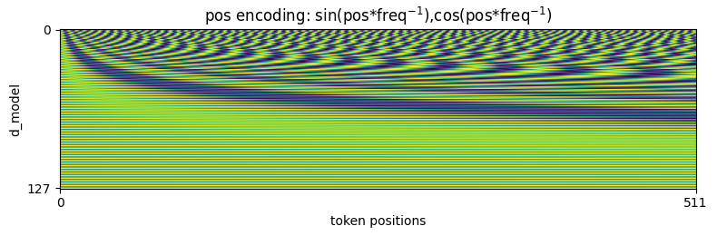
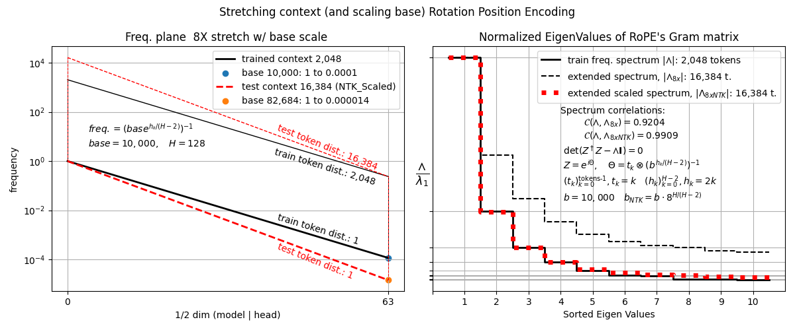
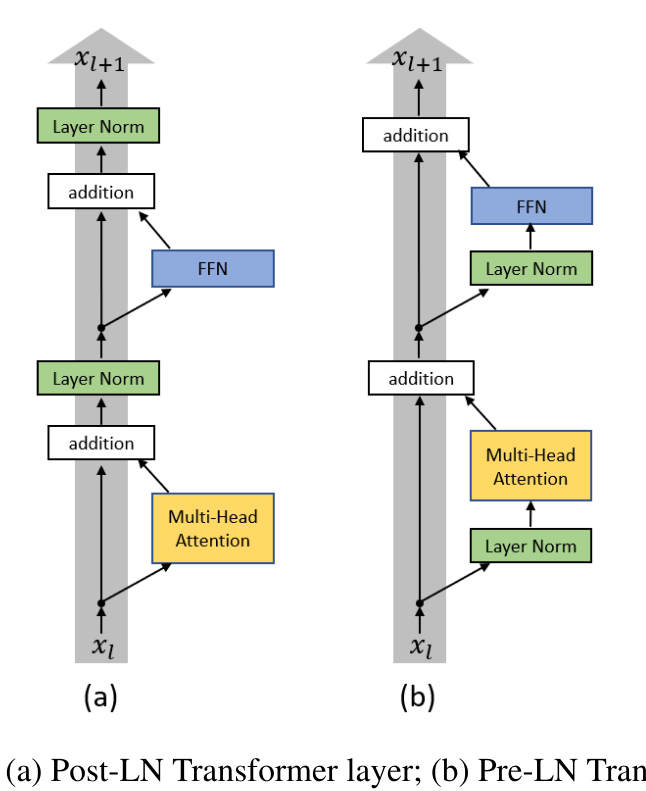

# Attention
* Vaswani 2017 [Attention is All We Need](https://proceedings.neurips.cc/paper_files/paper/2017/file/3f5ee243547dee91fbd053c1c4a845aa-Paper.pdf)
* Sequential Information is learned by the Transformer architecture using Self Attention blocks which identify features, followed by 2 layer 'feed forward' linear models which expand threshold and contract the latent. The size of the input and latent data at input and output of every block is identical. 
Sequence of fixed size -> tokenized -> mapped to language embedding weights -> (input) (Attention + input -> FFN) -> (Attention + last block -> FFN) -> (...) -> Linear Layer()
## Data:
* a tokenized vocabulary. Each tokenizer has a different `vocab_size`. e.g. GPT2 is 510257 individual tokens
* a text corpus
## Weights: 
The basic transfomer learns information of several types:
* `Embeddings `. Each token indexes a 'model_size' tensor from vocabulary embeddings
    * $W_E$ `(vocab_size, d_mod)` : the token vocabulary X model size
    * `d_mod`, VAswani 2017 was `512` ,BERT is `768`, others may be larger e.g. `2048`
    * `vocab_size`, number of tokens in vocabulary, GPT is `510257` 
* `Attention weights`, each attention block:
    * $W_K$ `(d_mod, d_k)`     Key weight  d_k = d_mod/num_heads typically #
    * $W_Q$ `(d_mod, d_k)`     Query weight                        
    * $W_V$ `(d_mod, d_v)`     Value weight  # d_v = d_mod/num_heads typically
    * $W_O$ `(d_mod, d_mod)`   Output weight 
A self-attention layer connects all positions with a constant number of sequentially
executed operation
* `FFN` Feed Forward Network
    * $W_{up}$ `(4*d_mod, d_mod)`   expand weight 
    * $W_{dn}$ `(d_mod, 4*d_mod)`   contract weight` 
* ... with variants, new transformer blocks
* Final Linear Layer
    * $W_L = W_E$ `Linear module weight: (vocab_size, d_mod)` 
    * shared with Embeddings on transformer init,  Press and Wolf 2017 [Using the Output Embedding to Improve Language Models](https://arxiv.org/pdf/1608.05859)

### What attention & transformer learns?
* $W_E\qquad$ token Embeddings `(vocab_size, d_mod)`: every token learns a `d_mod` tensor for the entire text corpus
* ATTN ($W_E$`[tokens]+ PE[:len(tokens)]`) -> reorders info
    * $W_K$, $W_Q\quad$ Jointly learn to distinguish salient features of contextuually aligned tokens
    * $W_V\qquad$ Learns scaling of Key-Query identified features
    * $W_O\qquad$ Learns the joint information from the multiple heads
* FFN (ATTN + Residual) -> Memorizes info
    * $W_{up}\qquad$ Learns how to expand and isolate latent dimensions
        * Thresholded by ReLU max(0, x) in Vaswani, affects W_dn on forward and W_up on backward
    * $W_{dn}\qquad$ Contracts to latent tensor `(B, T, d_{mod})` learning filtered information
* ...
* $W_L\qquad$ The final layer of the model. Learns an updated mapping
 
The read address (ATTN) and memory slot (FFN) are learned jointly -> later layers allocate unused capacity and dont run out of address space. Different features of language are learned at different depths.
* weight init keeps variance at ~1.
* layer-wise probing shows monotonic downstream-task improvement until very deep (192 layers) if width is scaled accordingly.

### Self attention
1. computational complexity per layer $O(n^2\cdot d)$ $n$: seqence length, $d$: representation dimension
    * recurrent  $O(n\cdot d^2)$
    * convolution   $O(k\cdot n\cdot d^2)$ $k$: kernel size
2. parallelization, minimum number of sequential ops
3. path length between long range dependencies: 1: Self-attention. Connects all positions in constant num of operations.
## Position Encoding

Unlike convolutions which contain position information, Attention mechanism reorganizes the input data, in order to ensure that the positions of the tokenized sentence indexed into the vocabulary is maintained, a position encoding is added, which is formed by sines powers of sines and cosines. Each `d_model` length colum corresponding to a token at position pos is encoded with alternating `sin(pos* inv freq)`, `cos(pos* inv freq)`, were `pos` is linear token position, (0 to last token), and `inv freq` is a log interpolation of 1 to 1/10000 along the depth of the model. The corresponding token column is added to the embedding slice.



### Rotational Position Encoding RoPE
Su et al 2021 [RoFormer: Enhanced Transformer with Rotary Position Embedding](https://arxiv.org/pdf/2104.09864), Uses on the fly $e^{i\theta}$ instead of $\sin(\theta), \cos(\theta)$, where $\theta =t_k\cdot f^{-1}$  is the product of the inverse frequencies and the token position. This yields tremendous benefits:
1. comparing two token positions $n, m$ becomes $e^{i\theta_n - \theta_m} = e^{i(t_n - t_m)/f}$: all positions are relative.
2. Allows to stretch the context at test time, as long as the frequency plane's base is scaled to maintain the eigenvalue of the Gram matrix of the phases coherent.
* Kaiokendev 2023, [Things_Im_Learning_While_Training_SuperHOT](https://kaiokendev.github.io/context). [colab](https://colab.research.google.com/drive/1VI2nhlyKvd5cw4-zHvAIk00cAVj2lCCC)
* Chen et al. 2023, [Extending Context Window of Large Language Models via Positional Interpolation](https://arxiv.org/abs/2306.15595)
* Peng et al. 2024, [Ya{RN}: Efficient Context Window Extension of Large Language Models](https://openreview.net/forum?id=wHBfxhZu1u), https://github.com/jquesnelle/yarn



## Information Flow of Predictions
`B: batch_size, T: num_tokens`
* Transformer is composed by Attention and Residuals
* Input and output of a Transformer is always the same size  `(1, T, d_mod)`
### Input: 
* `tokens = tokenize("This is a sentence.") -> Tensor([[1212,  318,  257, 6827, 13]])` e.g.
    *  tokenized tensor is capped (or padded) to size `T`. Some models , eg T5 accept `512`, ClipTextEncoder `77`,  Cloud LLMs chats have capacity for 1M, including history and self generated tokens.
* `x = Embedding[tokens]` : token tensor indexes into Embeddings: `(1, vocab_size, d_mod) -> (B, T, d_mod)`
* `x += Encodings[:, :T]` positional (exponential sines and cosines), relative or learned position encodings tensor shape `(1, T, d_mod) + x -> (B, T, d_mod)`

### Attention Sub Layer
Input is multiplied by Key, Query and Value weights, for simplicity assuming single head : $d_k = d_v = d_{mod}$
* $Q, K, V =  x \cdot (W_Q, W_K, W_V)$ Shape `(B,T,d_{mod}) @ (d_mod,d_mod) -> (B,T,d_mod)` or in multi head  $(B,T,d_{mod}) @ (d_{mod},(d_k \text{ or } d_v)) \to (B,T,(d_k \text{ or } d_v))$
$$\text{Attention}(Q,K,V) = \text{softmax}\left(\frac{Q\cdot K^T}{\sqrt{d_k}}\right)V $$
* $z = Q\cdot K^T\qquad\quad$:  `(B,T,d_k) @ (B,d_k,T) ->  (B,T,T)` : Query and Key weights to correlate and diverge.
* $z = z/\sqrt(d_k)\qquad$ : prevents saturation
* $z = \sigma(z) \qquad\qquad $: softmax(z) converts to probabilities, $\exp(z_i)/\sum_{j=1}^K \exp(z_j);\qquad \sum(\sigma(z)) = 1.$
* $z = z \cdot V\qquad\qquad$: attention highlights from Q@K.T to `(B,T,T) @ (B,T, d_v) ->  (B,T,d_v)` 
* $z = z \cdot W_O,\quad$ or in multi head attn  $z = (z_1, ..., z_h) \cdot W_O\quad$: contenates  attention heads `((B,T,d_v), ...,(B,T,d_v))@(d_{mod}, d_mod) ->  (B,T,d_mod) `
$$\text{MultiHeadAttention}(Q_i,K_i,V_i) = \left(\sigma \left(\frac{Q_1\cdot K_1^T}{\sqrt{d_k}}\right)V_1, ...,\sigma \left(\frac{Q_h\cdot K_h^T}{\sqrt{d_k}}\right)V_h  \right)\cdot W_O$$
* **Layer norm and residuals**
* $x = norm(x + ATTN(x)) $

### Feed Forward Network Sub Layer
Standard 2 layer MLP, expand 4x, threshold, and contract back
* $FFN = max(0, x \cdot W_{up} + b_{up}) \cdot W_{dn} + b_{dn} $
* **Layer norm and residuals**
* $x = norm(x + FFN(x)) $


### Output Layer
$ \text{logits} = z \cdot W_L $ `(B,T,d_mod) @ (vocab_size, d_mod) ->  (B,T,vocab_size)`

## Training
* Output predictions : `(B,T,vocab_size) -> (BxT,vocab_size) `
* Targets: `y = (BxT)`
* `Loss = XEntropy(logix, y)`
### Dropout layers after every sublayer
* `x = x + dropout(attn(norm(x)))`
* `x = x + dropout(ffn(norm(x)))`

## Scaling Laws
Kaplan & McCandlish et al. 2020 [Scaling Laws for Neural Language Models](https://arxiv.org/pdf/2001.08361)
* performance depends on strongly on scale, weakly on model shape.
* scale quadratically improves performance linearly
    * `N` param number ( excluding Embeddings)
    * `D` dataset size
    * `C` compute size
* model shape: depth vs width

* `N` and `D` need to increase together in `N/D ~ 8/5` - One bit of data is worth 1.6 parmeter bits.? 
* transfer improves linearly with training performance
* With more comput optimal parameters to batchsize, `N/B = 10,000` as `C` increases 
* Critial Batch size for a target Loss -- where ireasing batch size learns sub optimally
$$B_{\text{crit}}(L) = \frac{B_*}{L^{1/\alpha_B}}, \quad B_* \sim 2\cdot 10^8 \text{ tokens },\quad \alpha_B \sim 0.21$$

* d_model ≈ 64 · √(n_layers)


## Variants and Updates

### Post Normalization

Original Vaswani 2017. Layer normaliztion is applied after submodule  `x = LayerNorm(x + Sublayer(x))`
$$(Q,K,V) = x \cdot (W_Q , W_K , W_V )\\
z = norm \left(x +\left(\sigma\left(\frac{Q\cdot K^T}{\sqrt{d_k}}\right) \cdot V\right)\cdot W_O \right)\qquad\text{Attention}\\
z = norm(z + max(0, z \cdot W_{up} + b_{up}) \cdot W_{dn} + b_{dn})\qquad\text{FFN }$$

### Pre Normalization
normalizes before a sublayer but not on the residual branch `x = x + Sublayer(LayerNorm(x))`
* Xiong et al 2020 [On Layer Normalization in the Transformer Architecture](https://arxiv.org/pdf/2002.04745)
Showed that it stabilized the initial training.

$$
(Q,K,V) = norm(x) \cdot (W_Q, W_K, W_V)\\
z = x + \left(\sigma\left(\frac{Q\cdot K^T}{\sqrt{d_k}}\right) \cdot V\right)\cdot W_O\qquad\text{Attention}\\
z = z + max(0, norm(z) \cdot W_{up} + b_{up}) \cdot W_{dn} + b_{dn}\qquad\text{FFN}$$

## Masking
On inference, causal mask set 

## Architecture Variants
* Encoder Decoder architecture
* Pure Encoder
* Pure Decoder
### Pure Encoder Transfomer
* x = Embeddings[tokens] + PosEnc[T:]
* Attention Blocks
    *   x = attn(x) + x
    *   x = ffn(x) + x
* Attention Blocks ...
* ..
* Linear
* Softmax
* Loss


## Masking strategies


```
Python Library Documentation: class Attention in module diffusers.models.attention_processor

class Attention(torch.nn.modules.module.Module)
 |  Attention(
 |      query_dim: int,
 |      cross_attention_dim: Optional[int] = None,
 |      heads: int = 8,
 |      kv_heads: Optional[int] = None,
 |      dim_head: int = 64,
 |      dropout: float = 0.0,
 |      bias: bool = False,
 |      upcast_attention: bool = False,
 |      upcast_softmax: bool = False,
 |      cross_attention_norm: Optional[str] = None,
 |      cross_attention_norm_num_groups: int = 32,
 |      qk_norm: Optional[str] = None,
 |      added_kv_proj_dim: Optional[int] = None,
 |      added_proj_bias: Optional[bool] = True,
 |      norm_num_groups: Optional[int] = None,
 |      spatial_norm_dim: Optional[int] = None,
 |      out_bias: bool = True,
 |      scale_qk: bool = True,
 |      only_cross_attention: bool = False,
 |      eps: float = 1e-05,
 |      rescale_output_factor: float = 1.0,
 |      residual_connection: bool = False,
 |      _from_deprecated_attn_block: bool = False,
 |      processor: Optional[ForwardRef('AttnProcessor')] = None,
 |      out_dim: int = None,
 |      out_context_dim: int = None,
 |      context_pre_only=None,
 |      pre_only=False,
 |      elementwise_affine: bool = True,
 |      is_causal: bool = False
 |  )
 |
 |  A cross attention layer.
 |
 |  Parameters:
 |      query_dim (`int`):
 |          The number of channels in the query.
 |      cross_attention_dim (`int`, *optional*):
 |          The number of channels in the encoder_hidden_states. If not given, defaults to `query_dim`.
 |      heads (`int`,  *optional*, defaults to 8):
 |          The number of heads to use for multi-head attention.
 |      kv_heads (`int`,  *optional*, defaults to `None`):
 |          The number of key and value heads to use for multi-head attention. Defaults to `heads`. If
 |          `kv_heads=heads`, the model will use Multi Head Attention (MHA), if `kv_heads=1` the model will use Multi
 |          Query Attention (MQA) otherwise GQA is used.
 |      dim_head (`int`,  *optional*, defaults to 64):
 |          The number of channels in each head.
 |      dropout (`float`, *optional*, defaults to 0.0):
 |          The dropout probability to use.
 |      bias (`bool`, *optional*, defaults to False):
 |          Set to `True` for the query, key, and value linear layers to contain a bias parameter.
 |      upcast_attention (`bool`, *optional*, defaults to False):
 |          Set to `True` to upcast the attention computation to `float32`.
 |      upcast_softmax (`bool`, *optional*, defaults to False):
 |          Set to `True` to upcast the softmax computation to `float32`.
 |      cross_attention_norm (`str`, *optional*, defaults to `None`):
 |          The type of normalization to use for the cross attention. Can be `None`, `layer_norm`, or `group_norm`.
 |      cross_attention_norm_num_groups (`int`, *optional*, defaults to 32):
 |          The number of groups to use for the group norm in the cross attention.
 |      added_kv_proj_dim (`int`, *optional*, defaults to `None`):
 |          The number of channels to use for the added key and value projections. If `None`, no projection is used.
 |      norm_num_groups (`int`, *optional*, defaults to `None`):
 |          The number of groups to use for the group norm in the attention.
 |      spatial_norm_dim (`int`, *optional*, defaults to `None`):
 |          The number of channels to use for the spatial normalization.
 |      out_bias (`bool`, *optional*, defaults to `True`):
 |          Set to `True` to use a bias in the output linear layer.
 |      scale_qk (`bool`, *optional*, defaults to `True`):
 |          Set to `True` to scale the query and key by `1 / sqrt(dim_head)`.
 |      only_cross_attention (`bool`, *optional*, defaults to `False`):
 |          Set to `True` to only use cross attention and not added_kv_proj_dim. Can only be set to `True` if
 |          `added_kv_proj_dim` is not `None`.
 |      eps (`float`, *optional*, defaults to 1e-5):
 |          An additional value added to the denominator in group normalization that is used for numerical stability.
 |      rescale_output_factor (`float`, *optional*, defaults to 1.0):
 |          A factor to rescale the output by dividing it with this value.
 |      residual_connection (`bool`, *optional*, defaults to `False`):
 |          Set to `True` to add the residual connection to the output.
 |      _from_deprecated_attn_block (`bool`, *optional*, defaults to `False`):
 |          Set to `True` if the attention block is loaded from a deprecated state dict.
 |      processor (`AttnProcessor`, *optional*, defaults to `None`):
 |          The attention processor to use. If `None`, defaults to `AttnProcessor2_0` if `torch 2.x` is used and
 |          `AttnProcessor` otherwise.
 |
 |  Method resolution order:
 |      Attention
 |      torch.nn.modules.module.Module
 |      builtins.object
 |
 |  Methods defined here:
 |
 |  __init__(
 |      self,
 |      query_dim: int,
 |      cross_attention_dim: Optional[int] = None,
 |      heads: int = 8,
 |      kv_heads: Optional[int] = None,
 |      dim_head: int = 64,
 |      dropout: float = 0.0,
 |      bias: bool = False,
 |      upcast_attention: bool = False,
 |      upcast_softmax: bool = False,
 |      cross_attention_norm: Optional[str] = None,
 |      cross_attention_norm_num_groups: int = 32,
 |      qk_norm: Optional[str] = None,
 |      added_kv_proj_dim: Optional[int] = None,
 |      added_proj_bias: Optional[bool] = True,
 |      norm_num_groups: Optional[int] = None,
 |      spatial_norm_dim: Optional[int] = None,
 |      out_bias: bool = True,
 |      scale_qk: bool = True,
 |      only_cross_attention: bool = False,
 |      eps: float = 1e-05,
 |      rescale_output_factor: float = 1.0,
 |      residual_connection: bool = False,
 |      _from_deprecated_attn_block: bool = False,
 |      processor: Optional[ForwardRef('AttnProcessor')] = None,
 |      out_dim: int = None,
 |      out_context_dim: int = None,
 |      context_pre_only=None,
 |      pre_only=False,
 |      elementwise_affine: bool = True,
 |      is_causal: bool = False
 |  )
 |      Initialize internal Module state, shared by both nn.Module and ScriptModule.
 |
 |  batch_to_head_dim(self, tensor: torch.Tensor) -> torch.Tensor
 |      Reshape the tensor from `[batch_size, seq_len, dim]` to `[batch_size // heads, seq_len, dim * heads]`. `heads`
 |      is the number of heads initialized while constructing the `Attention` class.
 |
 |      Args:
 |          tensor (`torch.Tensor`): The tensor to reshape.
 |
 |      Returns:
 |          `torch.Tensor`: The reshaped tensor.
 |
 |  forward(
 |      self,
 |      hidden_states: torch.Tensor,
 |      encoder_hidden_states: Optional[torch.Tensor] = None,
 |      attention_mask: Optional[torch.Tensor] = None,
 |      **cross_attention_kwargs
 |  ) -> torch.Tensor
 |      The forward method of the `Attention` class.
 |
 |      Args:
 |          hidden_states (`torch.Tensor`):
 |              The hidden states of the query.
 |          encoder_hidden_states (`torch.Tensor`, *optional*):
 |              The hidden states of the encoder.
 |          attention_mask (`torch.Tensor`, *optional*):
 |              The attention mask to use. If `None`, no mask is applied.
 |          **cross_attention_kwargs:
 |              Additional keyword arguments to pass along to the cross attention.
 |
 |      Returns:
 |          `torch.Tensor`: The output of the attention layer.
 |
 |  fuse_projections(self, fuse=True)
 |
 |  get_attention_scores(
 |      self,
 |      query: torch.Tensor,
 |      key: torch.Tensor,
 |      attention_mask: Optional[torch.Tensor] = None
 |  ) -> torch.Tensor
 |      Compute the attention scores.
 |
 |      Args:
 |          query (`torch.Tensor`): The query tensor.
 |          key (`torch.Tensor`): The key tensor.
 |          attention_mask (`torch.Tensor`, *optional*): The attention mask to use. If `None`, no mask is applied.
 |
 |      Returns:
 |          `torch.Tensor`: The attention probabilities/scores.
 |
 |  get_processor(self, return_deprecated_lora: bool = False) -> 'AttentionProcessor'
 |      Get the attention processor in use.
 |
 |      Args:
 |          return_deprecated_lora (`bool`, *optional*, defaults to `False`):
 |              Set to `True` to return the deprecated LoRA attention processor.
 |
 |      Returns:
 |          "AttentionProcessor": The attention processor in use.
 |
 |  head_to_batch_dim(self, tensor: torch.Tensor, out_dim: int = 3) -> torch.Tensor
 |      Reshape the tensor from `[batch_size, seq_len, dim]` to `[batch_size, seq_len, heads, dim // heads]` `heads` is
 |      the number of heads initialized while constructing the `Attention` class.
 |
 |      Args:
 |          tensor (`torch.Tensor`): The tensor to reshape.
 |          out_dim (`int`, *optional*, defaults to `3`): The output dimension of the tensor. If `3`, the tensor is
 |              reshaped to `[batch_size * heads, seq_len, dim // heads]`.
 |
 |      Returns:
 |          `torch.Tensor`: The reshaped tensor.
 |
 |  norm_encoder_hidden_states(self, encoder_hidden_states: torch.Tensor) -> torch.Tensor
 |      Normalize the encoder hidden states. Requires `self.norm_cross` to be specified when constructing the
 |      `Attention` class.
 |
 |      Args:
 |          encoder_hidden_states (`torch.Tensor`): Hidden states of the encoder.
 |
 |      Returns:
 |          `torch.Tensor`: The normalized encoder hidden states.
 |
 |  prepare_attention_mask(
 |      self,
 |      attention_mask: torch.Tensor,
 |      target_length: int,
 |      batch_size: int,
 |      out_dim: int = 3
 |  ) -> torch.Tensor
 |      Prepare the attention mask for the attention computation.
 |
 |      Args:
 |          attention_mask (`torch.Tensor`):
 |              The attention mask to prepare.
 |          target_length (`int`):
 |              The target length of the attention mask. This is the length of the attention mask after padding.
 |          batch_size (`int`):
 |              The batch size, which is used to repeat the attention mask.
 |          out_dim (`int`, *optional*, defaults to `3`):
 |              The output dimension of the attention mask. Can be either `3` or `4`.
 |
 |      Returns:
 |          `torch.Tensor`: The prepared attention mask.
 |
 |  set_attention_slice(self, slice_size: int) -> None
 |      Set the slice size for attention computation.
 |
 |      Args:
 |          slice_size (`int`):
 |              The slice size for attention computation.
 |
 |  set_processor(self, processor: 'AttnProcessor') -> None
 |      Set the attention processor to use.
 |
 |      Args:
 |          processor (`AttnProcessor`):
 |              The attention processor to use.
 |
 |  set_use_memory_efficient_attention_xformers(
 |      self,
 |      use_memory_efficient_attention_xformers: bool,
 |      attention_op: Optional[Callable] = None
 |  ) -> None
 |      Set whether to use memory efficient attention from `xformers` or not.
 |
 |      Args:
 |          use_memory_efficient_attention_xformers (`bool`):
 |              Whether to use memory efficient attention from `xformers` or not.
 |          attention_op (`Callable`, *optional*):
 |              The attention operation to use. Defaults to `None` which uses the default attention operation from
 |              `xformers`.
 |
 |  set_use_npu_flash_attention(self, use_npu_flash_attention: bool) -> None
 |      Set whether to use npu flash attention from `torch_npu` or not.
 |
 |  set_use_xla_flash_attention(
 |      self,
 |      use_xla_flash_attention: bool,
 |      partition_spec: Optional[Tuple[Optional[str], ...]] = None,
 |      is_flux=False
 |  ) -> None
 |      Set whether to use xla flash attention from `torch_xla` or not.
 |
 |      Args:
 |          use_xla_flash_attention (`bool`):
 |              Whether to use pallas flash attention kernel from `torch_xla` or not.
 |          partition_spec (`Tuple[]`, *optional*):
 |              Specify the partition specification if using SPMD. Otherwise None.
 |
 |  ----------------------------------------------------------------------
 |  Data and other attributes defined here:
 |
 |  __annotations__ = {}
 |
 |  ----------------------------------------------------------------------
 |  Methods inherited from torch.nn.modules.module.Module:
 |
 |  __call__ = _wrapped_call_impl(self, *args, **kwargs)
 |
 |  __delattr__(self, name)
 |      Implement delattr(self, name).
 |
 |  __dir__(self)
 |      Default dir() implementation.
 |
 |  __getattr__(self, name: str) -> Union[torch.Tensor, ForwardRef('Module')]
 |      # It is crucial that the return type is not annotated as `Any`, otherwise type checking
 |      # on `torch.nn.Module` and all its subclasses is largely disabled as a result. See:
 |      # https://github.com/pytorch/pytorch/pull/115074
 |
 |  __getstate__(self)
 |      Helper for pickle.
 |
 |  __repr__(self)
 |      Return repr(self).
 |
 |  __setattr__(self, name: str, value: Union[torch.Tensor, ForwardRef('Module')]) -> None
 |      Implement setattr(self, name, value).
 |
 |  __setstate__(self, state)
 |
 |  add_module(self, name: str, module: Optional[ForwardRef('Module')]) -> None
 |      Add a child module to the current module.
 |
 |      The module can be accessed as an attribute using the given name.
 |
 |      Args:
 |          name (str): name of the child module. The child module can be
 |              accessed from this module using the given name
 |          module (Module): child module to be added to the module.
 |
 |  apply(self, fn: Callable[[ForwardRef('Module')], NoneType]) -> Self
 |      Apply ``fn`` recursively to every submodule (as returned by ``.children()``) as well as self.
 |
 |      Typical use includes initializing the parameters of a model
 |      (see also :ref:`nn-init-doc`).
 |
 |      Args:
 |          fn (:class:`Module` -> None): function to be applied to each submodule
 |
 |      Returns:
 |          Module: self
 |
 |      Example::
 |
 |          >>> @torch.no_grad()
 |          >>> def init_weights(m):
 |          >>>     print(m)
 |          >>>     if type(m) == nn.Linear:
 |          >>>         m.weight.fill_(1.0)
 |          >>>         print(m.weight)
 |          >>> net = nn.Sequential(nn.Linear(2, 2), nn.Linear(2, 2))
 |          >>> net.apply(init_weights)
 |          Linear(in_features=2, out_features=2, bias=True)
 |          Parameter containing:
 |          tensor([[1., 1.],
 |                  [1., 1.]], requires_grad=True)
 |          Linear(in_features=2, out_features=2, bias=True)
 |          Parameter containing:
 |          tensor([[1., 1.],
 |                  [1., 1.]], requires_grad=True)
 |          Sequential(
 |            (0): Linear(in_features=2, out_features=2, bias=True)
 |            (1): Linear(in_features=2, out_features=2, bias=True)
 |          )
 |
 |  bfloat16(self) -> Self
 |      Casts all floating point parameters and buffers to ``bfloat16`` datatype.
 |
 |      .. note::
 |          This method modifies the module in-place.
 |
 |      Returns:
 |          Module: self
 |
 |  buffers(self, recurse: bool = True) -> collections.abc.Iterator[torch.Tensor]
 |      Return an iterator over module buffers.
 |
 |      Args:
 |          recurse (bool): if True, then yields buffers of this module
 |              and all submodules. Otherwise, yields only buffers that
 |              are direct members of this module.
 |
 |      Yields:
 |          torch.Tensor: module buffer
 |
 |      Example::
 |
 |          >>> # xdoctest: +SKIP("undefined vars")
 |          >>> for buf in model.buffers():
 |          >>>     print(type(buf), buf.size())
 |          <class 'torch.Tensor'> (20L,)
 |          <class 'torch.Tensor'> (20L, 1L, 5L, 5L)
 |
 |  children(self) -> collections.abc.Iterator['Module']
 |      Return an iterator over immediate children modules.
 |
 |      Yields:
 |          Module: a child module
 |
 |  compile(self, *args, **kwargs)
 |      Compile this Module's forward using :func:`torch.compile`.
 |
 |      This Module's `__call__` method is compiled and all arguments are passed as-is
 |      to :func:`torch.compile`.
 |
 |      See :func:`torch.compile` for details on the arguments for this function.
 |
 |  cpu(self) -> Self
 |      Move all model parameters and buffers to the CPU.
 |
 |      .. note::
 |          This method modifies the module in-place.
 |
 |      Returns:
 |          Module: self
 |
 |  cuda(self, device: Union[torch.device, int, NoneType] = None) -> Self
 |      Move all model parameters and buffers to the GPU.
 |
 |      This also makes associated parameters and buffers different objects. So
 |      it should be called before constructing the optimizer if the module will
 |      live on GPU while being optimized.
 |
 |      .. note::
 |          This method modifies the module in-place.
 |
 |      Args:
 |          device (int, optional): if specified, all parameters will be
 |              copied to that device
 |
 |      Returns:
 |          Module: self
 |
 |  double(self) -> Self
 |      Casts all floating point parameters and buffers to ``double`` datatype.
 |
 |      .. note::
 |          This method modifies the module in-place.
 |
 |      Returns:
 |          Module: self
 |
 |  eval(self) -> Self
 |      Set the module in evaluation mode.
 |
 |      This has an effect only on certain modules. See the documentation of
 |      particular modules for details of their behaviors in training/evaluation
 |      mode, i.e. whether they are affected, e.g. :class:`Dropout`, :class:`BatchNorm`,
 |      etc.
 |
 |      This is equivalent with :meth:`self.train(False) <torch.nn.Module.train>`.
 |
 |      See :ref:`locally-disable-grad-doc` for a comparison between
 |      `.eval()` and several similar mechanisms that may be confused with it.
 |
 |      Returns:
 |          Module: self
 |
 |  extra_repr(self) -> str
 |      Return the extra representation of the module.
 |
 |      To print customized extra information, you should re-implement
 |      this method in your own modules. Both single-line and multi-line
 |      strings are acceptable.
 |
 |  float(self) -> Self
 |      Casts all floating point parameters and buffers to ``float`` datatype.
 |
 |      .. note::
 |          This method modifies the module in-place.
 |
 |      Returns:
 |          Module: self
 |
 |  get_buffer(self, target: str) -> 'Tensor'
 |      Return the buffer given by ``target`` if it exists, otherwise throw an error.
 |
 |      See the docstring for ``get_submodule`` for a more detailed
 |      explanation of this method's functionality as well as how to
 |      correctly specify ``target``.
 |
 |      Args:
 |          target: The fully-qualified string name of the buffer
 |              to look for. (See ``get_submodule`` for how to specify a
 |              fully-qualified string.)
 |
 |      Returns:
 |          torch.Tensor: The buffer referenced by ``target``
 |
 |      Raises:
 |          AttributeError: If the target string references an invalid
 |              path or resolves to something that is not a
 |              buffer
 |
 |  get_extra_state(self) -> Any
 |      Return any extra state to include in the module's state_dict.
 |
 |      Implement this and a corresponding :func:`set_extra_state` for your module
 |      if you need to store extra state. This function is called when building the
 |      module's `state_dict()`.
 |
 |      Note that extra state should be picklable to ensure working serialization
 |      of the state_dict. We only provide backwards compatibility guarantees
 |      for serializing Tensors; other objects may break backwards compatibility if
 |      their serialized pickled form changes.
 |
 |      Returns:
 |          object: Any extra state to store in the module's state_dict
 |
 |  get_parameter(self, target: str) -> 'Parameter'
 |      Return the parameter given by ``target`` if it exists, otherwise throw an error.
 |
 |      See the docstring for ``get_submodule`` for a more detailed
 |      explanation of this method's functionality as well as how to
 |      correctly specify ``target``.
 |
 |      Args:
 |          target: The fully-qualified string name of the Parameter
 |              to look for. (See ``get_submodule`` for how to specify a
 |              fully-qualified string.)
 |
 |      Returns:
 |          torch.nn.Parameter: The Parameter referenced by ``target``
 |
 |      Raises:
 |          AttributeError: If the target string references an invalid
 |              path or resolves to something that is not an
 |              ``nn.Parameter``
 |
 |  get_submodule(self, target: str) -> 'Module'
 |      Return the submodule given by ``target`` if it exists, otherwise throw an error.
 |
 |      For example, let's say you have an ``nn.Module`` ``A`` that
 |      looks like this:
 |
 |      .. code-block:: text
 |
 |          A(
 |              (net_b): Module(
 |                  (net_c): Module(
 |                      (conv): Conv2d(16, 33, kernel_size=(3, 3), stride=(2, 2))
 |                  )
 |                  (linear): Linear(in_features=100, out_features=200, bias=True)
 |              )
 |          )
 |
 |      (The diagram shows an ``nn.Module`` ``A``. ``A`` which has a nested
 |      submodule ``net_b``, which itself has two submodules ``net_c``
 |      and ``linear``. ``net_c`` then has a submodule ``conv``.)
 |
 |      To check whether or not we have the ``linear`` submodule, we
 |      would call ``get_submodule("net_b.linear")``. To check whether
 |      we have the ``conv`` submodule, we would call
 |      ``get_submodule("net_b.net_c.conv")``.
 |
 |      The runtime of ``get_submodule`` is bounded by the degree
 |      of module nesting in ``target``. A query against
 |      ``named_modules`` achieves the same result, but it is O(N) in
 |      the number of transitive modules. So, for a simple check to see
 |      if some submodule exists, ``get_submodule`` should always be
 |      used.
 |
 |      Args:
 |          target: The fully-qualified string name of the submodule
 |              to look for. (See above example for how to specify a
 |              fully-qualified string.)
 |
 |      Returns:
 |          torch.nn.Module: The submodule referenced by ``target``
 |
 |      Raises:
 |          AttributeError: If at any point along the path resulting from
 |              the target string the (sub)path resolves to a non-existent
 |              attribute name or an object that is not an instance of ``nn.Module``.
 |
 |  half(self) -> Self
 |      Casts all floating point parameters and buffers to ``half`` datatype.
 |
 |      .. note::
 |          This method modifies the module in-place.
 |
 |      Returns:
 |          Module: self
 |
 |  ipu(self, device: Union[torch.device, int, NoneType] = None) -> Self
 |      Move all model parameters and buffers to the IPU.
 |
 |      This also makes associated parameters and buffers different objects. So
 |      it should be called before constructing the optimizer if the module will
 |      live on IPU while being optimized.
 |
 |      .. note::
 |          This method modifies the module in-place.
 |
 |      Arguments:
 |          device (int, optional): if specified, all parameters will be
 |              copied to that device
 |
 |      Returns:
 |          Module: self
 |
 |  load_state_dict(
 |      self,
 |      state_dict: collections.abc.Mapping[str, typing.Any],
 |      strict: bool = True,
 |      assign: bool = False
 |  )
 |      Copy parameters and buffers from :attr:`state_dict` into this module and its descendants.
 |
 |      If :attr:`strict` is ``True``, then
 |      the keys of :attr:`state_dict` must exactly match the keys returned
 |      by this module's :meth:`~torch.nn.Module.state_dict` function.
 |
 |      .. warning::
 |          If :attr:`assign` is ``True`` the optimizer must be created after
 |          the call to :attr:`load_state_dict` unless
 |          :func:`~torch.__future__.get_swap_module_params_on_conversion` is ``True``.
 |
 |      Args:
 |          state_dict (dict): a dict containing parameters and
 |              persistent buffers.
 |          strict (bool, optional): whether to strictly enforce that the keys
 |              in :attr:`state_dict` match the keys returned by this module's
 |              :meth:`~torch.nn.Module.state_dict` function. Default: ``True``
 |          assign (bool, optional): When set to ``False``, the properties of the tensors
 |              in the current module are preserved whereas setting it to ``True`` preserves
 |              properties of the Tensors in the state dict. The only
 |              exception is the ``requires_grad`` field of :class:`~torch.nn.Parameter`
 |              for which the value from the module is preserved. Default: ``False``
 |
 |      Returns:
 |          ``NamedTuple`` with ``missing_keys`` and ``unexpected_keys`` fields:
 |              * ``missing_keys`` is a list of str containing any keys that are expected
 |                  by this module but missing from the provided ``state_dict``.
 |              * ``unexpected_keys`` is a list of str containing the keys that are not
 |                  expected by this module but present in the provided ``state_dict``.
 |
 |      Note:
 |          If a parameter or buffer is registered as ``None`` and its corresponding key
 |          exists in :attr:`state_dict`, :meth:`load_state_dict` will raise a
 |          ``RuntimeError``.
 |
 |  modules(self) -> collections.abc.Iterator['Module']
 |      Return an iterator over all modules in the network.
 |
 |      Yields:
 |          Module: a module in the network
 |
 |      Note:
 |          Duplicate modules are returned only once. In the following
 |          example, ``l`` will be returned only once.
 |
 |      Example::
 |
 |          >>> l = nn.Linear(2, 2)
 |          >>> net = nn.Sequential(l, l)
 |          >>> for idx, m in enumerate(net.modules()):
 |          ...     print(idx, '->', m)
 |
 |          0 -> Sequential(
 |            (0): Linear(in_features=2, out_features=2, bias=True)
 |            (1): Linear(in_features=2, out_features=2, bias=True)
 |          )
 |          1 -> Linear(in_features=2, out_features=2, bias=True)
 |
 |  mtia(self, device: Union[torch.device, int, NoneType] = None) -> Self
 |      Move all model parameters and buffers to the MTIA.
 |
 |      This also makes associated parameters and buffers different objects. So
 |      it should be called before constructing the optimizer if the module will
 |      live on MTIA while being optimized.
 |
 |      .. note::
 |          This method modifies the module in-place.
 |
 |      Arguments:
 |          device (int, optional): if specified, all parameters will be
 |              copied to that device
 |
 |      Returns:
 |          Module: self
 |
 |  named_buffers(
 |      self,
 |      prefix: str = '',
 |      recurse: bool = True,
 |      remove_duplicate: bool = True
 |  ) -> collections.abc.Iterator[tuple[str, torch.Tensor]]
 |      Return an iterator over module buffers, yielding both the name of the buffer as well as the buffer itself.
 |
 |      Args:
 |          prefix (str): prefix to prepend to all buffer names.
 |          recurse (bool, optional): if True, then yields buffers of this module
 |              and all submodules. Otherwise, yields only buffers that
 |              are direct members of this module. Defaults to True.
 |          remove_duplicate (bool, optional): whether to remove the duplicated buffers in the result. Defaults to True.
 |
 |      Yields:
 |          (str, torch.Tensor): Tuple containing the name and buffer
 |
 |      Example::
 |
 |          >>> # xdoctest: +SKIP("undefined vars")
 |          >>> for name, buf in self.named_buffers():
 |          >>>     if name in ['running_var']:
 |          >>>         print(buf.size())
 |
 |  named_children(self) -> collections.abc.Iterator[tuple[str, 'Module']]
 |      Return an iterator over immediate children modules, yielding both the name of the module as well as the module itself.
 |
 |      Yields:
 |          (str, Module): Tuple containing a name and child module
 |
 |      Example::
 |
 |          >>> # xdoctest: +SKIP("undefined vars")
 |          >>> for name, module in model.named_children():
 |          >>>     if name in ['conv4', 'conv5']:
 |          >>>         print(module)
 |
 |  named_modules(
 |      self,
 |      memo: Optional[set['Module']] = None,
 |      prefix: str = '',
 |      remove_duplicate: bool = True
 |  )
 |      Return an iterator over all modules in the network, yielding both the name of the module as well as the module itself.
 |
 |      Args:
 |          memo: a memo to store the set of modules already added to the result
 |          prefix: a prefix that will be added to the name of the module
 |          remove_duplicate: whether to remove the duplicated module instances in the result
 |              or not
 |
 |      Yields:
 |          (str, Module): Tuple of name and module
 |
 |      Note:
 |          Duplicate modules are returned only once. In the following
 |          example, ``l`` will be returned only once.
 |
 |      Example::
 |
 |          >>> l = nn.Linear(2, 2)
 |          >>> net = nn.Sequential(l, l)
 |          >>> for idx, m in enumerate(net.named_modules()):
 |          ...     print(idx, '->', m)
 |
 |          0 -> ('', Sequential(
 |            (0): Linear(in_features=2, out_features=2, bias=True)
 |            (1): Linear(in_features=2, out_features=2, bias=True)
 |          ))
 |          1 -> ('0', Linear(in_features=2, out_features=2, bias=True))
 |
 |  named_parameters(
 |      self,
 |      prefix: str = '',
 |      recurse: bool = True,
 |      remove_duplicate: bool = True
 |  ) -> collections.abc.Iterator[tuple[str, torch.nn.parameter.Parameter]]
 |      Return an iterator over module parameters, yielding both the name of the parameter as well as the parameter itself.
 |
 |      Args:
 |          prefix (str): prefix to prepend to all parameter names.
 |          recurse (bool): if True, then yields parameters of this module
 |              and all submodules. Otherwise, yields only parameters that
 |              are direct members of this module.
 |          remove_duplicate (bool, optional): whether to remove the duplicated
 |              parameters in the result. Defaults to True.
 |
 |      Yields:
 |          (str, Parameter): Tuple containing the name and parameter
 |
 |      Example::
 |
 |          >>> # xdoctest: +SKIP("undefined vars")
 |          >>> for name, param in self.named_parameters():
 |          >>>     if name in ['bias']:
 |          >>>         print(param.size())
 |
 |  parameters(self, recurse: bool = True) -> collections.abc.Iterator[torch.nn.parameter.Parameter]
 |      Return an iterator over module parameters.
 |
 |      This is typically passed to an optimizer.
 |
 |      Args:
 |          recurse (bool): if True, then yields parameters of this module
 |              and all submodules. Otherwise, yields only parameters that
 |              are direct members of this module.
 |
 |      Yields:
 |          Parameter: module parameter
 |
 |      Example::
 |
 |          >>> # xdoctest: +SKIP("undefined vars")
 |          >>> for param in model.parameters():
 |          >>>     print(type(param), param.size())
 |          <class 'torch.Tensor'> (20L,)
 |          <class 'torch.Tensor'> (20L, 1L, 5L, 5L)
 |
 |  register_backward_hook(
 |      self,
 |      hook: Callable[[ForwardRef('Module'), Union[tuple[torch.Tensor, ...], torch.Tensor], Union[tuple[torch.Tensor, ...], torch.Tensor]], Union[NoneType, tuple[torch.Tensor, ...], torch.Tensor]]
 |  ) -> torch.utils.hooks.RemovableHandle
 |      Register a backward hook on the module.
 |
 |      This function is deprecated in favor of :meth:`~torch.nn.Module.register_full_backward_hook` and
 |      the behavior of this function will change in future versions.
 |
 |      Returns:
 |          :class:`torch.utils.hooks.RemovableHandle`:
 |              a handle that can be used to remove the added hook by calling
 |              ``handle.remove()``
 |
 |  register_buffer(
 |      self,
 |      name: str,
 |      tensor: Optional[torch.Tensor],
 |      persistent: bool = True
 |  ) -> None
 |      Add a buffer to the module.
 |
 |      This is typically used to register a buffer that should not be
 |      considered a model parameter. For example, BatchNorm's ``running_mean``
 |      is not a parameter, but is part of the module's state. Buffers, by
 |      default, are persistent and will be saved alongside parameters. This
 |      behavior can be changed by setting :attr:`persistent` to ``False``. The
 |      only difference between a persistent buffer and a non-persistent buffer
 |      is that the latter will not be a part of this module's
 |      :attr:`state_dict`.
 |
 |      Buffers can be accessed as attributes using given names.
 |
 |      Args:
 |          name (str): name of the buffer. The buffer can be accessed
 |              from this module using the given name
 |          tensor (Tensor or None): buffer to be registered. If ``None``, then operations
 |              that run on buffers, such as :attr:`cuda`, are ignored. If ``None``,
 |              the buffer is **not** included in the module's :attr:`state_dict`.
 |          persistent (bool): whether the buffer is part of this module's
 |              :attr:`state_dict`.
 |
 |      Example::
 |
 |          >>> # xdoctest: +SKIP("undefined vars")
 |          >>> self.register_buffer('running_mean', torch.zeros(num_features))
 |
 |  register_forward_hook(
 |      self,
 |      hook: Union[Callable[[~T, tuple[Any, ...], Any], Optional[Any]], Callable[[~T, tuple[Any, ...], dict[str, Any], Any], Optional[Any]]],
 |      *,
 |      prepend: bool = False,
 |      with_kwargs: bool = False,
 |      always_call: bool = False
 |  ) -> torch.utils.hooks.RemovableHandle
 |      Register a forward hook on the module.
 |
 |      The hook will be called every time after :func:`forward` has computed an output.
 |
 |      If ``with_kwargs`` is ``False`` or not specified, the input contains only
 |      the positional arguments given to the module. Keyword arguments won't be
 |      passed to the hooks and only to the ``forward``. The hook can modify the
 |      output. It can modify the input inplace but it will not have effect on
 |      forward since this is called after :func:`forward` is called. The hook
 |      should have the following signature::
 |
 |          hook(module, args, output) -> None or modified output
 |
 |      If ``with_kwargs`` is ``True``, the forward hook will be passed the
 |      ``kwargs`` given to the forward function and be expected to return the
 |      output possibly modified. The hook should have the following signature::
 |
 |          hook(module, args, kwargs, output) -> None or modified output
 |
 |      Args:
 |          hook (Callable): The user defined hook to be registered.
 |          prepend (bool): If ``True``, the provided ``hook`` will be fired
 |              before all existing ``forward`` hooks on this
 |              :class:`torch.nn.Module`. Otherwise, the provided
 |              ``hook`` will be fired after all existing ``forward`` hooks on
 |              this :class:`torch.nn.Module`. Note that global
 |              ``forward`` hooks registered with
 |              :func:`register_module_forward_hook` will fire before all hooks
 |              registered by this method.
 |              Default: ``False``
 |          with_kwargs (bool): If ``True``, the ``hook`` will be passed the
 |              kwargs given to the forward function.
 |              Default: ``False``
 |          always_call (bool): If ``True`` the ``hook`` will be run regardless of
 |              whether an exception is raised while calling the Module.
 |              Default: ``False``
 |
 |      Returns:
 |          :class:`torch.utils.hooks.RemovableHandle`:
 |              a handle that can be used to remove the added hook by calling
 |              ``handle.remove()``
 |
 |  register_forward_pre_hook(
 |      self,
 |      hook: Union[Callable[[~T, tuple[Any, ...]], Optional[Any]], Callable[[~T, tuple[Any, ...], dict[str, Any]], Optional[tuple[Any, dict[str, Any]]]]],
 |      *,
 |      prepend: bool = False,
 |      with_kwargs: bool = False
 |  ) -> torch.utils.hooks.RemovableHandle
 |      Register a forward pre-hook on the module.
 |
 |      The hook will be called every time before :func:`forward` is invoked.
 |
 |
 |      If ``with_kwargs`` is false or not specified, the input contains only
 |      the positional arguments given to the module. Keyword arguments won't be
 |      passed to the hooks and only to the ``forward``. The hook can modify the
 |      input. User can either return a tuple or a single modified value in the
 |      hook. We will wrap the value into a tuple if a single value is returned
 |      (unless that value is already a tuple). The hook should have the
 |      following signature::
 |
 |          hook(module, args) -> None or modified input
 |
 |      If ``with_kwargs`` is true, the forward pre-hook will be passed the
 |      kwargs given to the forward function. And if the hook modifies the
 |      input, both the args and kwargs should be returned. The hook should have
 |      the following signature::
 |
 |          hook(module, args, kwargs) -> None or a tuple of modified input and kwargs
 |
 |      Args:
 |          hook (Callable): The user defined hook to be registered.
 |          prepend (bool): If true, the provided ``hook`` will be fired before
 |              all existing ``forward_pre`` hooks on this
 |              :class:`torch.nn.Module`. Otherwise, the provided
 |              ``hook`` will be fired after all existing ``forward_pre`` hooks
 |              on this :class:`torch.nn.Module`. Note that global
 |              ``forward_pre`` hooks registered with
 |              :func:`register_module_forward_pre_hook` will fire before all
 |              hooks registered by this method.
 |              Default: ``False``
 |          with_kwargs (bool): If true, the ``hook`` will be passed the kwargs
 |              given to the forward function.
 |              Default: ``False``
 |
 |      Returns:
 |          :class:`torch.utils.hooks.RemovableHandle`:
 |              a handle that can be used to remove the added hook by calling
 |              ``handle.remove()``
 |
 |  register_full_backward_hook(
 |      self,
 |      hook: Callable[[ForwardRef('Module'), Union[tuple[torch.Tensor, ...], torch.Tensor], Union[tuple[torch.Tensor, ...], torch.Tensor]], Union[NoneType, tuple[torch.Tensor, ...], torch.Tensor]],
 |      prepend: bool = False
 |  ) -> torch.utils.hooks.RemovableHandle
 |      Register a backward hook on the module.
 |
 |      The hook will be called every time the gradients with respect to a module are computed, and its firing rules are as follows:
 |
 |          1. Ordinarily, the hook fires when the gradients are computed with respect to the module inputs.
 |          2. If none of the module inputs require gradients, the hook will fire when the gradients are computed
 |             with respect to module outputs.
 |          3. If none of the module outputs require gradients, then the hooks will not fire.
 |
 |      The hook should have the following signature::
 |
 |          hook(module, grad_input, grad_output) -> tuple(Tensor) or None
 |
 |      The :attr:`grad_input` and :attr:`grad_output` are tuples that contain the gradients
 |      with respect to the inputs and outputs respectively. The hook should
 |      not modify its arguments, but it can optionally return a new gradient with
 |      respect to the input that will be used in place of :attr:`grad_input` in
 |      subsequent computations. :attr:`grad_input` will only correspond to the inputs given
 |      as positional arguments and all kwarg arguments are ignored. Entries
 |      in :attr:`grad_input` and :attr:`grad_output` will be ``None`` for all non-Tensor
 |      arguments.
 |
 |      For technical reasons, when this hook is applied to a Module, its forward function will
 |      receive a view of each Tensor passed to the Module. Similarly the caller will receive a view
 |      of each Tensor returned by the Module's forward function.
 |
 |      .. warning ::
 |          Modifying inputs or outputs inplace is not allowed when using backward hooks and
 |          will raise an error.
 |
 |      Args:
 |          hook (Callable): The user-defined hook to be registered.
 |          prepend (bool): If true, the provided ``hook`` will be fired before
 |              all existing ``backward`` hooks on this
 |              :class:`torch.nn.Module`. Otherwise, the provided
 |              ``hook`` will be fired after all existing ``backward`` hooks on
 |              this :class:`torch.nn.Module`. Note that global
 |              ``backward`` hooks registered with
 |              :func:`register_module_full_backward_hook` will fire before
 |              all hooks registered by this method.
 |
 |      Returns:
 |          :class:`torch.utils.hooks.RemovableHandle`:
 |              a handle that can be used to remove the added hook by calling
 |              ``handle.remove()``
 |
 |  register_full_backward_pre_hook(
 |      self,
 |      hook: Callable[[ForwardRef('Module'), Union[tuple[torch.Tensor, ...], torch.Tensor]], Union[NoneType, tuple[torch.Tensor, ...], torch.Tensor]],
 |      prepend: bool = False
 |  ) -> torch.utils.hooks.RemovableHandle
 |      Register a backward pre-hook on the module.
 |
 |      The hook will be called every time the gradients for the module are computed.
 |      The hook should have the following signature::
 |
 |          hook(module, grad_output) -> tuple[Tensor] or None
 |
 |      The :attr:`grad_output` is a tuple. The hook should
 |      not modify its arguments, but it can optionally return a new gradient with
 |      respect to the output that will be used in place of :attr:`grad_output` in
 |      subsequent computations. Entries in :attr:`grad_output` will be ``None`` for
 |      all non-Tensor arguments.
 |
 |      For technical reasons, when this hook is applied to a Module, its forward function will
 |      receive a view of each Tensor passed to the Module. Similarly the caller will receive a view
 |      of each Tensor returned by the Module's forward function.
 |
 |      .. warning ::
 |          Modifying inputs inplace is not allowed when using backward hooks and
 |          will raise an error.
 |
 |      Args:
 |          hook (Callable): The user-defined hook to be registered.
 |          prepend (bool): If true, the provided ``hook`` will be fired before
 |              all existing ``backward_pre`` hooks on this
 |              :class:`torch.nn.Module`. Otherwise, the provided
 |              ``hook`` will be fired after all existing ``backward_pre`` hooks
 |              on this :class:`torch.nn.Module`. Note that global
 |              ``backward_pre`` hooks registered with
 |              :func:`register_module_full_backward_pre_hook` will fire before
 |              all hooks registered by this method.
 |
 |      Returns:
 |          :class:`torch.utils.hooks.RemovableHandle`:
 |              a handle that can be used to remove the added hook by calling
 |              ``handle.remove()``
 |
 |  register_load_state_dict_post_hook(self, hook)
 |      Register a post-hook to be run after module's :meth:`~nn.Module.load_state_dict` is called.
 |
 |      It should have the following signature::
 |          hook(module, incompatible_keys) -> None
 |
 |      The ``module`` argument is the current module that this hook is registered
 |      on, and the ``incompatible_keys`` argument is a ``NamedTuple`` consisting
 |      of attributes ``missing_keys`` and ``unexpected_keys``. ``missing_keys``
 |      is a ``list`` of ``str`` containing the missing keys and
 |      ``unexpected_keys`` is a ``list`` of ``str`` containing the unexpected keys.
 |
 |      The given incompatible_keys can be modified inplace if needed.
 |
 |      Note that the checks performed when calling :func:`load_state_dict` with
 |      ``strict=True`` are affected by modifications the hook makes to
 |      ``missing_keys`` or ``unexpected_keys``, as expected. Additions to either
 |      set of keys will result in an error being thrown when ``strict=True``, and
 |      clearing out both missing and unexpected keys will avoid an error.
 |
 |      Returns:
 |          :class:`torch.utils.hooks.RemovableHandle`:
 |              a handle that can be used to remove the added hook by calling
 |              ``handle.remove()``
 |
 |  register_load_state_dict_pre_hook(self, hook)
 |      Register a pre-hook to be run before module's :meth:`~nn.Module.load_state_dict` is called.
 |
 |      It should have the following signature::
 |          hook(module, state_dict, prefix, local_metadata, strict, missing_keys, unexpected_keys, error_msgs) -> None  # noqa: B950
 |
 |      Arguments:
 |          hook (Callable): Callable hook that will be invoked before
 |              loading the state dict.
 |
 |  register_module(self, name: str, module: Optional[ForwardRef('Module')]) -> None
 |      Alias for :func:`add_module`.
 |
 |  register_parameter(
 |      self,
 |      name: str,
 |      param: Optional[torch.nn.parameter.Parameter]
 |  ) -> None
 |      Add a parameter to the module.
 |
 |      The parameter can be accessed as an attribute using given name.
 |
 |      Args:
 |          name (str): name of the parameter. The parameter can be accessed
 |              from this module using the given name
 |          param (Parameter or None): parameter to be added to the module. If
 |              ``None``, then operations that run on parameters, such as :attr:`cuda`,
 |              are ignored. If ``None``, the parameter is **not** included in the
 |              module's :attr:`state_dict`.
 |
 |  register_state_dict_post_hook(self, hook)
 |      Register a post-hook for the :meth:`~torch.nn.Module.state_dict` method.
 |
 |      It should have the following signature::
 |          hook(module, state_dict, prefix, local_metadata) -> None
 |
 |      The registered hooks can modify the ``state_dict`` inplace.
 |
 |  register_state_dict_pre_hook(self, hook)
 |      Register a pre-hook for the :meth:`~torch.nn.Module.state_dict` method.
 |
 |      It should have the following signature::
 |          hook(module, prefix, keep_vars) -> None
 |
 |      The registered hooks can be used to perform pre-processing before the ``state_dict``
 |      call is made.
 |
 |  requires_grad_(self, requires_grad: bool = True) -> Self
 |      Change if autograd should record operations on parameters in this module.
 |
 |      This method sets the parameters' :attr:`requires_grad` attributes
 |      in-place.
 |
 |      This method is helpful for freezing part of the module for finetuning
 |      or training parts of a model individually (e.g., GAN training).
 |
 |      See :ref:`locally-disable-grad-doc` for a comparison between
 |      `.requires_grad_()` and several similar mechanisms that may be confused with it.
 |
 |      Args:
 |          requires_grad (bool): whether autograd should record operations on
 |                                parameters in this module. Default: ``True``.
 |
 |      Returns:
 |          Module: self
 |
 |  set_extra_state(self, state: Any) -> None
 |      Set extra state contained in the loaded `state_dict`.
 |
 |      This function is called from :func:`load_state_dict` to handle any extra state
 |      found within the `state_dict`. Implement this function and a corresponding
 |      :func:`get_extra_state` for your module if you need to store extra state within its
 |      `state_dict`.
 |
 |      Args:
 |          state (dict): Extra state from the `state_dict`
 |
 |  set_submodule(self, target: str, module: 'Module', strict: bool = False) -> None
 |      Set the submodule given by ``target`` if it exists, otherwise throw an error.
 |
 |      .. note::
 |          If ``strict`` is set to ``False`` (default), the method will replace an existing submodule
 |          or create a new submodule if the parent module exists. If ``strict`` is set to ``True``,
 |          the method will only attempt to replace an existing submodule and throw an error if
 |          the submodule does not exist.
 |
 |      For example, let's say you have an ``nn.Module`` ``A`` that
 |      looks like this:
 |
 |      .. code-block:: text
 |
 |          A(
 |              (net_b): Module(
 |                  (net_c): Module(
 |                      (conv): Conv2d(3, 3, 3)
 |                  )
 |                  (linear): Linear(3, 3)
 |              )
 |          )
 |
 |      (The diagram shows an ``nn.Module`` ``A``. ``A`` has a nested
 |      submodule ``net_b``, which itself has two submodules ``net_c``
 |      and ``linear``. ``net_c`` then has a submodule ``conv``.)
 |
 |      To override the ``Conv2d`` with a new submodule ``Linear``, you
 |      could call ``set_submodule("net_b.net_c.conv", nn.Linear(1, 1))``
 |      where ``strict`` could be ``True`` or ``False``
 |
 |      To add a new submodule ``Conv2d`` to the existing ``net_b`` module,
 |      you would call ``set_submodule("net_b.conv", nn.Conv2d(1, 1, 1))``.
 |
 |      In the above if you set ``strict=True`` and call
 |      ``set_submodule("net_b.conv", nn.Conv2d(1, 1, 1), strict=True)``, an AttributeError
 |      will be raised because ``net_b`` does not have a submodule named ``conv``.
 |
 |      Args:
 |          target: The fully-qualified string name of the submodule
 |              to look for. (See above example for how to specify a
 |              fully-qualified string.)
 |          module: The module to set the submodule to.
 |          strict: If ``False``, the method will replace an existing submodule
 |              or create a new submodule if the parent module exists. If ``True``,
 |              the method will only attempt to replace an existing submodule and throw an error
 |              if the submodule doesn't already exist.
 |
 |      Raises:
 |          ValueError: If the ``target`` string is empty or if ``module`` is not an instance of ``nn.Module``.
 |          AttributeError: If at any point along the path resulting from
 |              the ``target`` string the (sub)path resolves to a non-existent
 |              attribute name or an object that is not an instance of ``nn.Module``.
 |
 |  share_memory(self) -> Self
 |      See :meth:`torch.Tensor.share_memory_`.
 |
 |  state_dict(self, *args, destination=None, prefix='', keep_vars=False)
 |      Return a dictionary containing references to the whole state of the module.
 |
 |      Both parameters and persistent buffers (e.g. running averages) are
 |      included. Keys are corresponding parameter and buffer names.
 |      Parameters and buffers set to ``None`` are not included.
 |
 |      .. note::
 |          The returned object is a shallow copy. It contains references
 |          to the module's parameters and buffers.
 |
 |      .. warning::
 |          Currently ``state_dict()`` also accepts positional arguments for
 |          ``destination``, ``prefix`` and ``keep_vars`` in order. However,
 |          this is being deprecated and keyword arguments will be enforced in
 |          future releases.
 |
 |      .. warning::
 |          Please avoid the use of argument ``destination`` as it is not
 |          designed for end-users.
 |
 |      Args:
 |          destination (dict, optional): If provided, the state of module will
 |              be updated into the dict and the same object is returned.
 |              Otherwise, an ``OrderedDict`` will be created and returned.
 |              Default: ``None``.
 |          prefix (str, optional): a prefix added to parameter and buffer
 |              names to compose the keys in state_dict. Default: ``''``.
 |          keep_vars (bool, optional): by default the :class:`~torch.Tensor` s
 |              returned in the state dict are detached from autograd. If it's
 |              set to ``True``, detaching will not be performed.
 |              Default: ``False``.
 |
 |      Returns:
 |          dict:
 |              a dictionary containing a whole state of the module
 |
 |      Example::
 |
 |          >>> # xdoctest: +SKIP("undefined vars")
 |          >>> module.state_dict().keys()
 |          ['bias', 'weight']
 |
 |  to(self, *args, **kwargs)
 |      Move and/or cast the parameters and buffers.
 |
 |      This can be called as
 |
 |      .. function:: to(device=None, dtype=None, non_blocking=False)
 |         :noindex:
 |
 |      .. function:: to(dtype, non_blocking=False)
 |         :noindex:
 |
 |      .. function:: to(tensor, non_blocking=False)
 |         :noindex:
 |
 |      .. function:: to(memory_format=torch.channels_last)
 |         :noindex:
 |
 |      Its signature is similar to :meth:`torch.Tensor.to`, but only accepts
 |      floating point or complex :attr:`dtype`\ s. In addition, this method will
 |      only cast the floating point or complex parameters and buffers to :attr:`dtype`
 |      (if given). The integral parameters and buffers will be moved
 |      :attr:`device`, if that is given, but with dtypes unchanged. When
 |      :attr:`non_blocking` is set, it tries to convert/move asynchronously
 |      with respect to the host if possible, e.g., moving CPU Tensors with
 |      pinned memory to CUDA devices.
 |
 |      See below for examples.
 |
 |      .. note::
 |          This method modifies the module in-place.
 |
 |      Args:
 |          device (:class:`torch.device`): the desired device of the parameters
 |              and buffers in this module
 |          dtype (:class:`torch.dtype`): the desired floating point or complex dtype of
 |              the parameters and buffers in this module
 |          tensor (torch.Tensor): Tensor whose dtype and device are the desired
 |              dtype and device for all parameters and buffers in this module
 |          memory_format (:class:`torch.memory_format`): the desired memory
 |              format for 4D parameters and buffers in this module (keyword
 |              only argument)
 |
 |      Returns:
 |          Module: self
 |
 |      Examples::
 |
 |          >>> # xdoctest: +IGNORE_WANT("non-deterministic")
 |          >>> linear = nn.Linear(2, 2)
 |          >>> linear.weight
 |          Parameter containing:
 |          tensor([[ 0.1913, -0.3420],
 |                  [-0.5113, -0.2325]])
 |          >>> linear.to(torch.double)
 |          Linear(in_features=2, out_features=2, bias=True)
 |          >>> linear.weight
 |          Parameter containing:
 |          tensor([[ 0.1913, -0.3420],
 |                  [-0.5113, -0.2325]], dtype=torch.float64)
 |          >>> # xdoctest: +REQUIRES(env:TORCH_DOCTEST_CUDA1)
 |          >>> gpu1 = torch.device("cuda:1")
 |          >>> linear.to(gpu1, dtype=torch.half, non_blocking=True)
 |          Linear(in_features=2, out_features=2, bias=True)
 |          >>> linear.weight
 |          Parameter containing:
 |          tensor([[ 0.1914, -0.3420],
 |                  [-0.5112, -0.2324]], dtype=torch.float16, device='cuda:1')
 |          >>> cpu = torch.device("cpu")
 |          >>> linear.to(cpu)
 |          Linear(in_features=2, out_features=2, bias=True)
 |          >>> linear.weight
 |          Parameter containing:
 |          tensor([[ 0.1914, -0.3420],
 |                  [-0.5112, -0.2324]], dtype=torch.float16)
 |
 |          >>> linear = nn.Linear(2, 2, bias=None).to(torch.cdouble)
 |          >>> linear.weight
 |          Parameter containing:
 |          tensor([[ 0.3741+0.j,  0.2382+0.j],
 |                  [ 0.5593+0.j, -0.4443+0.j]], dtype=torch.complex128)
 |          >>> linear(torch.ones(3, 2, dtype=torch.cdouble))
 |          tensor([[0.6122+0.j, 0.1150+0.j],
 |                  [0.6122+0.j, 0.1150+0.j],
 |                  [0.6122+0.j, 0.1150+0.j]], dtype=torch.complex128)
 |
 |  to_empty(
 |      self,
 |      *,
 |      device: Union[int, str, torch.device, NoneType],
 |      recurse: bool = True
 |  ) -> Self
 |      Move the parameters and buffers to the specified device without copying storage.
 |
 |      Args:
 |          device (:class:`torch.device`): The desired device of the parameters
 |              and buffers in this module.
 |          recurse (bool): Whether parameters and buffers of submodules should
 |              be recursively moved to the specified device.
 |
 |      Returns:
 |          Module: self
 |
 |  train(self, mode: bool = True) -> Self
 |      Set the module in training mode.
 |
 |      This has an effect only on certain modules. See the documentation of
 |      particular modules for details of their behaviors in training/evaluation
 |      mode, i.e., whether they are affected, e.g. :class:`Dropout`, :class:`BatchNorm`,
 |      etc.
 |
 |      Args:
 |          mode (bool): whether to set training mode (``True``) or evaluation
 |                       mode (``False``). Default: ``True``.
 |
 |      Returns:
 |          Module: self
 |
 |  type(self, dst_type: Union[torch.dtype, str]) -> Self
 |      Casts all parameters and buffers to :attr:`dst_type`.
 |
 |      .. note::
 |          This method modifies the module in-place.
 |
 |      Args:
 |          dst_type (type or string): the desired type
 |
 |      Returns:
 |          Module: self
 |
 |  xpu(self, device: Union[torch.device, int, NoneType] = None) -> Self
 |      Move all model parameters and buffers to the XPU.
 |
 |      This also makes associated parameters and buffers different objects. So
 |      it should be called before constructing optimizer if the module will
 |      live on XPU while being optimized.
 |
 |      .. note::
 |          This method modifies the module in-place.
 |
 |      Arguments:
 |          device (int, optional): if specified, all parameters will be
 |              copied to that device
 |
 |      Returns:
 |          Module: self
 |
 |  zero_grad(self, set_to_none: bool = True) -> None
 |      Reset gradients of all model parameters.
 |
 |      See similar function under :class:`torch.optim.Optimizer` for more context.
 |
 |      Args:
 |          set_to_none (bool): instead of setting to zero, set the grads to None.
 |              See :meth:`torch.optim.Optimizer.zero_grad` for details.
 |
 |  ----------------------------------------------------------------------
 |  Data descriptors inherited from torch.nn.modules.module.Module:
 |
 |  __dict__
 |      dictionary for instance variables
 |
 |  __weakref__
 |      list of weak references to the object
 |
 |  ----------------------------------------------------------------------
 |  Data and other attributes inherited from torch.nn.modules.module.Module:
 |
 |  T_destination = ~T_destination
 |
 |  call_super_init = False
 |
 |  dump_patches = False

```
